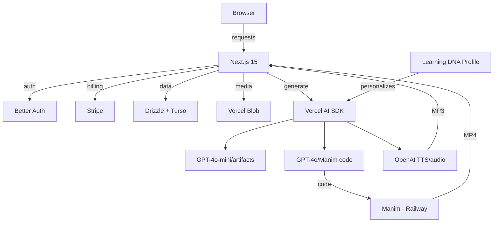

# dp-hackathon

Next.js 16 adaptive learning platform with AI chat, artifact generation, and learning profile DNA.

## Prerequisites (Mac)

If you've never coded on this Mac before, run these one at a time in Terminal:

### 1. Install Xcode Command Line Tools

```bash
xcode-select --install
```

A popup will appear — click "Install" and wait for it to finish.

### 2. Install Homebrew

```bash
/bin/bash -c "$(curl -fsSL https://raw.githubusercontent.com/Homebrew/install/HEAD/install.sh)"
```

Follow the instructions it prints at the end to add Homebrew to your PATH.

### 3. Install Node.js and Bun

```bash
brew install node
brew install oven-sh/bun/bun
```

Verify they installed:

```bash
node -v   # should print v22 or higher
bun -v    # should print 1.x
```

## Getting Started

### 1. Clone the repo

```bash
git clone https://github.com/dataportability-hackathon-2026/dp-hackathon.git
cd dp-hackathon
```

### 2. Install dependencies

```bash
bun install
```

### 3. Set up environment variables

```bash
cp .env.local.example .env.local
```

Open `.env.local` in a text editor and fill in your keys. Ask a teammate if you don't have them.

### 4. Install agent dependencies

```bash
cd agent && bun install && cd ..
```

### 5. Run the app

```bash
bun dev
```

This starts both the Next.js dev server and the LiveKit voice agent concurrently. Open [http://localhost:3000](http://localhost:3000) in your browser.

You can also run them individually:

```bash
bun run dev:next    # Next.js only
bun run dev:agent   # voice agent only
```

## Scripts

```
bun dev             # start Next.js + voice agent
bun run dev:next    # start Next.js only
bun run dev:agent   # start voice agent only
bun run build       # production build
bun start           # production server
bun run lint        # lint (biome)
bun run format      # format (biome)
```
## Project Structure

```
src/
  app/
    (marketing)/          # SEO landing pages
    dashboard/            # Main learning dashboard
    api/                  # API routes (chat, auth, billing, etc.)
  components/
    artifacts/            # Artifact canvas (quiz, flashcards, mindmap, slides, etc.)
    marketing/            # Landing page templates, nav, footer
    billing/              # Stripe billing + usage dialogs
  lib/
    ai/                   # AI generation (profiles, guides, artifacts)
    content/              # Marketing content data
    topics.ts             # Topic/project mock data
  db/                     # Drizzle schema + DB connection
```

## Tech Stack

### Frontend / App
| | |
|---|---|
| Framework | Next.js 15 (App Router, React 19, React Compiler) |
| Language | TypeScript |
| Styling | Tailwind CSS v4 + shadcn/ui |
| State | Zustand (in-memory `data-store` for real-time artifact state) |
| Media Storage | Vercel Blob (audio MP3s, Manim MP4s) |

### AI Layer
| | |
|---|---|
| AI SDK | Vercel AI SDK (`generateObject` / `generateText`) |
| LLM — Code gen | GPT-4o (Manim animation code) |
| LLM — Artifacts | GPT-4o-mini (quizzes, flashcards, mindmaps, slides, guides) |
| Text-to-Speech | OpenAI TTS (`tts-1`, voice `nova`) |
| Prompt System | Custom versioned templates in `prompts.ts` |

### Backend / Database
| | |
|---|---|
| Auth | Better Auth |
| ORM | Drizzle ORM + LibSQL / Turso |
| Billing | Stripe |

### Manim Animation Service
| | |
|---|---|
| Language | Python 3.11 |
| Framework | FastAPI + uvicorn |
| Hosting | Railway (separate microservice) |
| Animation | Manim Community Edition |

## Architecture

Learning DNA Profile Flow:
[Quiz] → [Profile Generation] → [Injected into every AI prompt]
                        → [Adapts: tone, structure, depth, format]

## Datasets & Frameworks Used

No external datasets were used. The system is grounded in the following psychological and academic frameworks:

| Framework | Source | Used For |
|---|---|---|
| Big Five Personality Model | Costa & McCrae | Openness, Conscientiousness, Extraversion, Agreeableness, Neuroticism dimensions |
| Felder-Silverman Learning Style Model | Felder & Silverman (1988); Felder & Soloman ILS (1991) | Visual/Verbal, Active/Reflective, Sensing/Intuitive, Sequential/Global dimensions |
| Metacognitive Awareness Inventory (MAI) | Schraw & Dennison (1994) | Self-monitoring, planning, and metacognitive regulation questions |
| Motivated Strategies for Learning Questionnaire (MSLQ) | Pintrich et al. (1991) | Motivation and study strategies |
| Tuckman Procrastination Scale (TPS) | Tuckman (1991) | Procrastination and self-regulation failure assessment |
| Cognitive Load Theory | Sweller (1988) | Session length, chunking, and information density preferences |

## Known Limitations

- **Profile is self-reported** — the Learning DNA is based on how users describe themselves, not observed behavior. Responses may not always reflect actual learning patterns.
- **Voice agent latency** — the LiveKit voice agent may experience latency depending on network conditions and API response times.
- **Artifact quality variance** — AI-generated artifacts (quizzes, mindmaps, slides) vary in quality depending on topic specificity and prompt complexity.
- **Cold start** — the profile is only generated after completing the quiz. First-time users see generic responses until the quiz is complete.

## Troubleshooting

**`command not found: bun`** — Restart your terminal after installing Homebrew and Bun.

**`xcode-select: error: command line tools are already installed`** — That's fine, move on.

**Port 3000 already in use** — Another app is using it. Kill it with `lsof -ti:3000 | xargs kill` or run `bun dev -- -p 3001`.

**Missing environment variables** — The app will crash on startup if keys are missing. Make sure `.env.local` is filled in.
